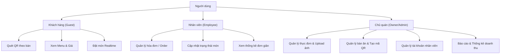

# DỰ ÁN HỆ THỐNG QUẢN LÝ QUÁN ĂN & ĐẶT MÓN QUA MÃ QR (QR ORDER)

---

## 1. Tổng quan dự án

**Hệ thống Quản lý Quán ăn & Đặt món qua QR (QR Order)** là giải pháp phần mềm toàn diện (Full-Stack) hỗ trợ tự động hóa và số hóa quy trình vận hành của nhà hàng, quán ăn hiện đại.

Dự án lấy cảm hứng từ mô hình giải pháp gọi món tại bàn của **Sapo FNB**, mang lại quy trình khép kín:

- **Khách hàng**: Quét mã QR tại bàn để xem thực đơn trực tiếp trên điện thoại và gửi đơn đặt món realtime.
- **Nhân viên & Bếp**: Nhận đơn đặt món tức thì qua WebSockets, xác nhận món và cập nhật trạng thái chế biến/phục vụ.
- **Chủ quán (Admin/Owner)**: Quản lý toàn bộ danh mục món ăn, bàn ăn, tài khoản nhân viên, hóa đơn và thống kê doanh thu chi tiết.

---

## 2. Mục đích của dự án

1. **Số hóa quy trình gọi món và phục vụ**:
   - Thay thế việc ghi chép thủ công bằng menu giấy và hóa đơn giấy truyền thống.
   - Giúp giảm thiểu tối đa sai sót đơn hàng (gọi nhầm món, sót món, sai bàn).

2. **Tiết kiệm nguồn nhân lực và tối ưu chi phí vận hành**:
   - Khách hàng chủ động tự xem menu, giá tiền và gửi order từ điện thoại cá nhân.
   - Nhân viên không cần túc trực tại từng bàn để ghi món, giúp tăng năng suất làm việc và tốc độ phục vụ.

3. **Cập nhật thời gian thực (Real-time Experience)**:
   - Sử dụng WebSockets (Socket.io) giúp đồng bộ dữ liệu ngay lập tức giữa Khách hàng ⇋ Nhân viên ⇋ Bếp ⇋ Quản lý.

4. **Nền tảng học tập, nghiên cứu và sản phẩm mẫu (Portfolio/Graduation Project)**:
   - Dự án được xây dựng theo chuẩn mực Full-Stack hiện đại với kiến trúc rõ ràng, áp dụng các công nghệ mới nhất (React 19, TanStack Router/Query, Fastify, Prisma, Zod, Socket.io).
   - Có thể sử dụng làm đồ án tốt nghiệp, dự án portfolio xin việc hoặc tiếp tục phát triển thành sản phẩm thương mại SaaS (Software-as-a-Service).

---

## 3. Các phân hệ và tính năng chính

Hệ thống phân quyền dựa trên 3 nhóm vai trò người dùng:



### 3.1. Phân hệ Khách hàng (Guest)

- **Truy cập qua mã QR**: Khách quét mã QR định danh cho từng bàn ăn mà không cần đăng ký tài khoản phức tạp.
- **Xem thực đơn điện tử**: Hiển thị danh mục món ăn kèm hình ảnh, giá cả, mô tả chi tiết và trạng thái món (còn món / hết món).
- **Đặt món trực tiếp**: Chọn số lượng món ăn và nhấn gửi đơn đặt món. Đơn được truyền ngay tới màn hình quản lý.
- **Theo dõi tiến độ**: Xem danh sách các món đã đặt và trạng thái xử lý (Chờ duyệt, Đang nấu, Đã giao,...).

### 3.2. Phân hệ Nhân viên (Employee)

- **Đăng nhập hệ thống**: Đăng nhập bằng tài khoản được cấp.
- **Quản lý đơn hàng (Orders)**:
  - Nhận thông báo âm thanh / popup khi có đơn đặt món mới từ các bàn.
  - Phê duyệt đơn, chuyển trạng thái chế biến hoặc từ chối nếu hết nguyên liệu.
- **Quản lý trạng thái bàn ăn**: Theo dõi bàn nào đang trống, bàn nào đang có khách ngồi.
- **Thanh toán & Hóa đơn**: Xem tổng tiền và hỗ trợ xuất hóa đơn khi khách yêu cầu thanh toán.

### 3.3. Phân hệ Quản trị viên / Chủ quán (Owner / Admin)

- **Quản lý món ăn (Dishes)**: Thêm, sửa, xóa món ăn, chỉnh sửa giá bán, tải ảnh món ăn lên máy chủ, bật/tắt trạng thái mở bán.
- **Quản lý bàn ăn (Tables)**: Tạo bàn mới, cài đặt sức chứa số người, sinh token bàn và xuất mã QR tương ứng cho từng bàn.
- **Quản lý nhân sự (Staffs)**: Tạo tài khoản nhân viên mới, phân quyền và quản lý danh sách nhân viên.
- **Thống kê doanh thu & Phân tích**: Báo cáo tổng doanh thu theo ngày/tháng, số lượng đơn hàng, món ăn bán chạy nhất.
- **Cấu hình cá nhân**: Đổi mật khẩu, cập nhật thông tin cửa hàng, avatar.

---

## 4. Kiến trúc và Công nghệ sử dụng

### 4.1. Frontend (`client/`)

- **Core**: [React 19](https://react.dev/) + [Vite](https://vitejs.dev/) + [TypeScript](https://www.typescriptlang.org/)
- **Routing**: [TanStack Router](https://tanstack.com/router) (File-based Routing, Type-safe tuyệt đối, hỗ trợ Data Loaders và Auth Guards)
- **State Management**:
  - Server State: [TanStack Query v5 (React Query)](https://tanstack.com/query) giúp cache, tự động đồng bộ và revalidate dữ liệu API.
  - Client State: [Zustand](https://zustand-demo.pmnd.rs/) quản lý trạng thái đăng nhập (token, thông tin user).
- **UI & Styling**:
  - [Tailwind CSS v4](https://tailwindcss.com/)
  - [Shadcn UI](https://ui.shadcn.com/) / [Radix UI](https://www.radix-ui.com/)
  - [Lucide Icons](https://lucide.dev/)
- **Form & Validation**: [React Hook Form](https://react-hook-form.com/) kết hợp [Zod](https://zod.dev/)
- **Giao tiếp Real-time**: [Socket.io-client](https://socket.io/)

### 4.2. Backend (`server0/`)

- **Runtime**: [Node.js](https://nodejs.org/) (TypeScript)
- **Framework**: [Fastify v4](https://fastify.dev/) (Framework web hiệu năng cực cao, nhẹ hơn và nhanh hơn Express)
- **Database & ORM**: [SQLite](https://www.sqlite.org/) thông qua [Prisma ORM v5](https://www.prisma.io/)
- **Authentication**: JWT (JSON Web Token) với cơ chế cặp đôi **Access Token** & **Refresh Token**, mã hóa mật khẩu an toàn bằng `bcrypt`.
- **Validation**: Schema validation thông qua `zod` và `fastify-type-provider-zod`.
- **File Upload**: Xử lý upload ảnh món ăn / avatar qua `@fastify/multipart` và lưu trữ nội bộ vào thư mục `uploads/`.
- **Real-time Engine**: [Socket.io](https://socket.io/) được tích hợp qua `fastify-socket.io`.

### 4.3. Kiểm thử API (`postman/`)

- Có sẵn file Postman Collection: `Quản Lý Quán Ăn API v2.postman_collection.json` chứa toàn bộ kịch bản test API từ Auth, Dishes, Tables, Orders, Guest tới Upload Media.

---

## 5. Cấu trúc thư mục

```text
quan-ly-quan-an/
├── README.md                 # Tài liệu mô tả dự án và hướng dẫn sử dụng (File này)
├── client/                   # Mã nguồn Frontend ứng dụng web
│   ├── src/
│   │   ├── components/       # Các thành phần giao diện dùng chung & UI components (Shadcn UI)
│   │   ├── constants/        # Các hằng số cấu hình hệ thống
│   │   ├── hooks/            # Custom React Hooks
│   │   ├── lib/              # Các hàm tiện ích (utils, http client, socket...)
│   │   ├── queries/          # Các hook gọi API bằng TanStack Query
│   │   ├── routes/           # Các trang giao diện (quản lý bởi TanStack Router)
│   │   │   ├── _public/      # Các trang công khai (Đăng nhập, Đăng ký, Menu khách)
│   │   │   └── manage/       # Các trang quản trị (Bàn, Món ăn, Đơn hàng, Nhân viên, Thống kê)
│   │   ├── store/            # Global store (Zustand)
│   │   └── styles.css        # Cấu hình Tailwind CSS v4
│   ├── package.json
│   └── vite.config.ts
│
├── server0/                  # Mã nguồn Backend API & Realtime Server
│   ├── prisma/
│   │   └── schema.prisma     # Cấu hình lược đồ cơ sở dữ liệu Prisma
│   ├── src/
│   │   ├── controllers/      # Bộ điều khiển xử lý logic nghiệp vụ
│   │   ├── routes/           # Khai báo các API Endpoints (auth, dish, order, table, guest...)
│   │   ├── schemaValidations/# Schema Zod kiểm tra dữ liệu đầu vào / đầu ra của API
│   │   ├── plugins/          # Các plugin mở rộng Fastify
│   │   ├── database/         # Kết nối cơ sở dữ liệu Prisma Client
│   │   └── index.ts          # Điểm khởi chạy máy chủ Backend
│   ├── uploads/              # Thư mục lưu trữ hình ảnh upload
│   └── package.json
│
└── postman/                  # Công cụ kiểm thử API
    ├── Quản Lý Quán Ăn API v2.postman_collection.json
    └── README.md             # Hướng dẫn import và cấu hình biến môi trường Postman
```

---

## 6. Hướng dẫn cài đặt và chạy dự án

### 6.1. Yêu cầu hệ thống

- **Node.js**: Phiên bản 18.x hoặc 20.x trở lên
- **Trình quản lý gói**: `npm` hoặc `pnpm`

---

### 6.2. Khởi chạy Backend (`server0`)

1. Mở cửa sổ dòng lệnh và di chuyển vào thư mục `server0`:

   ```bash
   cd server0
   ```

2. Cài đặt các thư viện phụ thuộc:

   ```bash
   npm install
   ```

3. Chuẩn bị cơ sở dữ liệu SQLite:

   ```bash
   npx prisma generate
   npx prisma db push
   ```

   _(Tùy chọn) Để xem giao diện quản lý dữ liệu trực quan trên trình duyệt:_

   ```bash
   npx prisma studio
   # Mở http://localhost:5555
   ```

4. Khởi chạy Backend ở chế độ phát triển:
   ```bash
   npm run dev
   ```
   > Backend sẽ chạy tại địa chỉ: **http://localhost:4000**

---

### 6.3. Khởi chạy Frontend (`client`)

1. Mở một cửa sổ dòng lệnh khác và di chuyển vào thư mục `client`:

   ```bash
   cd client
   ```

2. Cài đặt dependencies (khuyến nghị dùng `pnpm` hoặc `npm`):

   ```bash
   pnpm install
   # hoặc: npm install
   ```

3. Khởi chạy Frontend:
   ```bash
   pnpm dev
   # hoặc: npm run dev
   ```
   > Frontend sẽ chạy tại địa chỉ: **http://localhost:3000**

---

### 6.4. Tài khoản mặc định hệ thống

| Vai trò                           | Email đăng nhập           | Mật khẩu mặc định |
| :-------------------------------- | :------------------------ | :---------------- |
| **Quản trị viên (Owner / Admin)** | `admin@gmail.com`         | `123456`          |
| **Nhân viên (Employee)**          | `phuminhdat@gmail.com`    | `123123`          |
| **Nhân viên (Employee)**          | `buianhson@gmail.com`     | `123123`          |
| **Nhân viên (Employee)**          | `ngocbichhuynh@gmail.com` | `123123`          |
| **Nhân viên (Employee)**          | `binhnguyen@gmail.com`    | `123123`          |

---

## 7. Thông tin mở rộng & Hướng phát triển

- **Thanh toán trực tuyến**: Tích hợp cổng thanh toán (VNPay, MoMo, ZaloPay) qua mã VietQR động để khách có thể thanh toán ngay trên điện thoại khi đặt món.
- **In hóa đơn tự động**: Kết nối với máy in nhiệt (ESC/POS) trong quầy thu ngân và khu vực bếp/pha chế.
- **Ứng dụng di động (Mobile App / PWA)**: Tối ưu hóa giao diện gọi món thành ứng dụng Progressive Web App (PWA) để khách hàng và nhân viên trải nghiệm mượt mà như app native.
