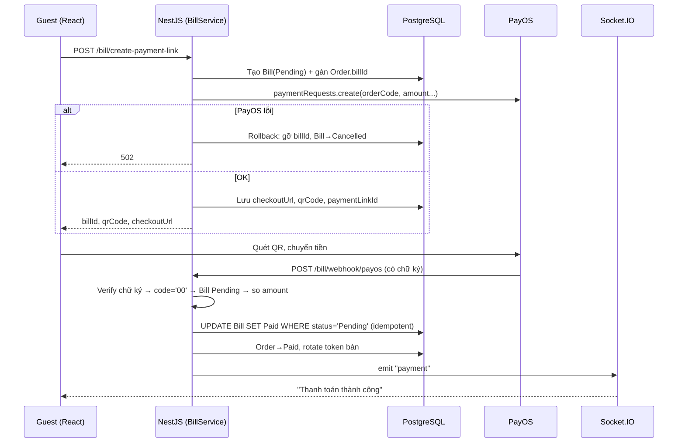

# Logic thanh toán VietQR / PayOS — Tài liệu tham khảo

> Rút ra từ module thanh toán của dự án **quan-ly-quan-an** (NestJS + Prisma + React + Socket.IO).
> Dùng làm checklist và mẫu thiết kế cho các dự án tích hợp cổng thanh toán kiểu
> "tạo link/QR → khách chuyển khoản → webhook".
>
> Ký hiệu: ✅ đã áp dụng · ❌ còn tồn đọng · 💡 đề xuất.
> Code **(đề xuất)** là hướng triển khai, chưa có trong dự án.

**Mục lục**
1. [Kiến trúc tổng quan](#1-kiến-trúc-tổng-quan)
2. [Quy tắc vàng](#2-quy-tắc-vàng)
3. [Tầng 1 — Các pattern đã áp dụng](#3-tầng-1--các-pattern-đã-áp-dụng)
4. [Vấn đề còn tồn đọng](#4-vấn-đề-còn-tồn-đọng)
5. [Tầng 2 — Độ tin cậy & kiểm chứng](#5-tầng-2--độ-tin-cậy--kiểm-chứng)
6. [Tầng 3 — Nâng cao](#6-tầng-3--nâng-cao)
7. [Quy tắc nghiệp vụ cần chốt](#7-quy-tắc-nghiệp-vụ-cần-chốt)
8. [Vận hành & triển khai](#8-vận-hành--triển-khai)
9. [Lộ trình & checklist](#9-lộ-trình--checklist)

---

## 1. Kiến trúc tổng quan



| Thành phần | File | Vai trò |
|---|---|---|
| Bill service | `server/src/bill/bill.service.ts` | Tạo link, xử lý webhook, hoàn tất thanh toán |
| Bill controller | `server/src/bill/bill.controller.ts` | Endpoint guest, manager, webhook |
| PayOS service | `server/src/payos/payos.service.ts` | Bọc SDK `@payos/node` (create / cancel / verify) |
| Env config | `server/src/config/env.config.ts` | Khóa PayOS bắt buộc, return/cancel URL |
| Model Bill | `server/prisma/schema.prisma` | `orderCode` BigInt unique, `status`, `paymentLinkId`… |
| QR dialog | `client/src/components/guest/payos-qr-dialog.tsx` | Máy trạng thái idle → loading → qr-ready → paid |
| Dialog thu ngân | `client/src/components/manage/orders/pay-guest-dialog.tsx` | Tiền mặt / VietQR tại quầy |

### Máy trạng thái

```
Bill:   Pending ──(webhook hợp lệ)──► Paid
           ├──(gọi thêm món / PayOS lỗi)──► Cancelled   (link PayOS cũng bị hủy)
           └──(quá hạn)──────────────────► Expired      ❌ chưa có
Order:  Pending/Processing/Delivered ──(gán Bill)──► … ──(Bill Paid)──► Paid
```

---

## 2. Quy tắc vàng

1. **Nguồn sự thật là webhook đã verify** (hoặc truy vấn lại cổng) — không phải return URL hay client.
2. **Verify chữ ký rồi mới kiểm tra nghiệp vụ**: mã thành công, số tiền, trạng thái bản ghi.
3. **Idempotent**: webhook có thể đến nhiều lần và đồng thời.
4. **Không để trạng thái nửa vời**: gọi cổng lỗi thì bù trừ (compensate).
5. **Hủy nội bộ ⇒ hủy ở cổng**: link cũ không được phép còn sống.
6. **Không có đường tắt ở production**: không mock, không endpoint giả lập.
7. **Kiểm tra quyền sở hữu** mọi endpoint đọc hóa đơn.
8. **Lưu đủ dữ liệu đối soát** (transactionId, paidAt, payload thô).

---

## 3. Tầng 1 — Các pattern đã áp dụng

Bảng dưới là các lỗi đã sửa; phần code là **pattern tái sử dụng được** cho dự án khác.

| # | Pattern | Lỗi trước đó | Vị trí |
|---|---|---|---|
| 1 | Webhook validation đầy đủ | Chỉ verify chữ ký, không kiểm tra code/amount/status | `BillService.handleWebhook` |
| 2 | Idempotency bằng conditional UPDATE | Check-then-act → race khi webhook trùng | `BillService.completeBillPayment` |
| 3 | Hủy link ở cổng khi hủy Bill | QR cũ vẫn trả được → tiền về Bill đã hủy | `PayosService.cancelPaymentLink` |
| 4 | Compensating action | PayOS lỗi → Bill rác, order bị khóa | `BillService.createPaymentLink` |
| 5 | Chống IDOR | Guest đọc được hóa đơn bàn khác | `GET /bill/:billId` |
| 6 | Fail-fast cấu hình, bỏ mock/giả lập | Thiếu env → chạy mock, webhook bỏ verify; nút giả lập lộ ra UI | `env.config.ts`, `PayosService.onModuleInit` |

### 3.1 Webhook validation

```ts
const data = await this.payosService.verifyWebhookData(body)   // 1. chữ ký
if (!data?.orderCode) return null
if (data.code !== '00') return null                            // 2. chỉ giao dịch thành công (dùng data.code vì data được ký)

const bill = await prisma.bill.findUnique({ where: { orderCode: BigInt(data.orderCode) } })
if (!bill) return null                                         // gồm cả webhook test khi đăng ký URL
if (bill.status === 'Paid') return null                        // trùng
if (bill.status !== 'Pending') { logger.error('💸 tiền về Bill đã hủy — đối soát'); return null }
if (data.amount !== bill.totalAmount) { logger.error('💸 sai số tiền'); return null }

return this.completeBillPayment(bill.id)
```

> Webhook luôn trả `200` cho cổng (kể cả khi bỏ qua) để cổng không retry vô hạn; lỗi nghiệp vụ được
> ghi log `error` để đối soát. Lỗi hạ tầng (DB sập) để ném `500` → cổng retry là hành vi mong muốn.

### 3.2 Idempotency bằng conditional UPDATE

```ts
await prisma.$transaction(async tx => {
  const { count } = await tx.bill.updateMany({
    where: { id: billId, status: 'Pending' },   // điều kiện nằm TRONG câu UPDATE
    data: { status: 'Paid' },
  })
  if (count === 0) return null                  // request khác đã thắng → không emit, không rotate
  // ... cập nhật Order, rotate token
})
```

**Lý thuyết:** PostgreSQL khóa hàng khi UPDATE; request thứ hai chờ, rồi đánh giá lại `WHERE` và thấy
`status='Paid'` → `count = 0`. Đây là *optimistic concurrency* ở mức câu lệnh, không cần `SELECT … FOR UPDATE`.

### 3.3 Hủy link ở cổng

```ts
if (existingPendingBill.paymentLinkId) {
  await payosService.cancelPaymentLink(Number(existingPendingBill.orderCode), 'Khach goi them mon')
}
// sau đó mới Bill → Cancelled
```

`cancelPaymentLink` nuốt lỗi (link có thể đã hết hạn) và chỉ log cảnh báo. Lưới an toàn cuối cùng vẫn là
mục 3.1: tiền về Bill `Cancelled` sẽ **không** được chốt và bị log để đối soát.

### 3.4 Compensating action

```ts
try {
  paymentResult = await payosService.createPaymentLink({ ... })
} catch (err) {
  await prisma.$transaction([
    prisma.order.updateMany({ where: { billId: bill.id }, data: { billId: null } }),
    prisma.bill.update({ where: { id: bill.id }, data: { status: 'Cancelled' } }),
  ])
  throw new StatusError({ message: 'Không tạo được mã thanh toán, vui lòng thử lại', status: 502 })
}
```

**Lý thuyết:** không thể bọc lời gọi HTTP ra ngoài trong DB transaction (giữ khóa lâu, và không rollback
được phía cổng). Thay vào đó dùng *Saga đơn giản*: mỗi bước có hành động bù trừ.

### 3.5 Chống IDOR

```ts
@Get(':billId')
@UseGuards(GuestAccessTokenGuard)
getBillDetail(@Param('billId', ParseIntPipe) billId: number, @ActiveUser('userId') guestId: number)

// service
prisma.bill.findFirst({ where: { id: billId, guestId } })   // không thuộc guest → 404 (không phải 403, tránh lộ sự tồn tại)
```

### 3.6 Fail-fast cấu hình, không mock ở production

```ts
// env.config.ts — thiếu khóa → app không khởi động
PAYOS_CLIENT_ID: z.string().min(1, 'PAYOS_CLIENT_ID không được để trống'),

// payos.service.ts — Nest await onModuleInit, lỗi thì app dừng (không fallback âm thầm)
async onModuleInit() {
  const { PayOS } = await import('@payos/node')
  this.payos = new PayOS({ clientId, apiKey, checksumKey })
}
```

Đã xóa: `isMockMode`, `createMockPaymentLink`, endpoint `POST /bill/simulate-payment`,
`SimulatePaymentBody`, hook `useSimulatePaymentMutation`, nút 🧪 ở cả hai dialog.

> 💡 Muốn test không tốn tiền: dùng **test bằng chữ ký thật** (mục 5.1) thay vì mock mode trong runtime.

---

## 4. Vấn đề còn tồn đọng

| # | Vấn đề | Mức | Xử lý ở |
|---|---|---|---|
| 1 | `generateOrderCode` dễ trùng (6 số cuối timestamp lặp sau ~16,6 phút + 9000 giá trị random), không retry | ❌ Cao | §5.5 |
| 2 | Tái dùng link Pending không kiểm tra hạn → QR chết | ❌ Trung bình | §5.3 |
| 3 | Rotate token bằng `Math.random()`; rotate khi bàn còn guest khác chưa trả | ❌ Trung bình | §4.1 |
| 4 | Client nhận **mọi** event `payment` là thành công; không fallback khi socket rớt | ❌ Trung bình | §5.4 |
| 5 | "Hủy thanh toán" ở UI chỉ đóng dialog; Bill + link vẫn sống | ❌ Thấp | §5.4 |
| 6 | `totalAmount` không đổi khi order trong Bill bị Rejected | ❌ Trung bình | §7 |
| 7 | Không kiểm tra `amount ≥ 2.000đ` (giới hạn PayOS) | ❌ Thấp | §6.4 |
| 8 | Manager tạo link không ghi `orderHandlerId` | ❌ Thấp | §6.6 |
| 9 | Webhook body chưa validate schema; chưa rate limit | ❌ Thấp | §6.4 |
| 10 | Không lưu `transactionId`, `paidAt`, payload thô | ❌ Trung bình | §5.2 |

### 4.1 Rotate token an toàn (đề xuất)

```ts
import { randomBytes } from 'node:crypto'
const newToken = randomBytes(16).toString('hex')

const unpaid = await tx.order.count({
  where: { tableNumber, status: { in: ['Pending', 'Processing', 'Delivered'] } },
})
if (unpaid === 0) { /* rotate */ }
```

---

## 5. Tầng 2 — Độ tin cậy & kiểm chứng

### 5.1 Bộ test cho luồng thanh toán

**Lý thuyết.** Code thanh toán khó test thủ công vì phụ thuộc tiền thật và thời điểm. Chia 3 lớp:

| Lớp | Công cụ | Kiểm tra |
|---|---|---|
| Unit | Vitest + mock Prisma/PayosService | Nhánh logic của `handleWebhook`, `createPaymentLink` |
| Integration | Vitest + PostgreSQL test (Docker/Testcontainers) | Idempotency thật, transaction, unique index |
| Contract | Tự ký payload bằng `checksumKey` test | Verify chữ ký đúng như PayOS |

**Tự ký webhook để test (không cần tiền thật):** PayOS ký `data` bằng HMAC-SHA256 trên chuỗi
`key1=value1&key2=value2…` (sắp xếp key theo alphabet) với `checksumKey`.

```ts
// test/helpers/payos-signature.ts (đề xuất)
import { createHmac } from 'node:crypto'
export function signPayOS(data: Record<string, unknown>, checksumKey: string) {
  const query = Object.keys(data).sort()
    .map(k => `${k}=${data[k] ?? ''}`).join('&')
  return createHmac('sha256', checksumKey).update(query).digest('hex')
}
```

**Ma trận case tối thiểu:**

| Nhóm | Case | Kỳ vọng |
|---|---|---|
| Chữ ký | sai chữ ký | `null`, không đổi DB |
| Mã | `data.code = '01'` | bỏ qua |
| Số tiền | thiếu / thừa | log error, Bill vẫn Pending |
| Trạng thái | Bill `Cancelled` | log error, không chốt |
| Idempotency | 2 webhook `Promise.all` | chỉ 1 lần Paid, 1 lần rotate, 1 lần emit |
| Tạo link | PayOS ném lỗi | Bill Cancelled, order `billId = null`, HTTP 502 |
| Gộp món | có Bill Pending + món mới | `cancelPaymentLink` được gọi với orderCode cũ |
| Bảo mật | guest A đọc Bill guest B | 404 |

> Test idempotency **phải** chạy trên DB thật — mock Prisma không mô phỏng được khóa hàng.

### 5.2 Audit log — bảng `PaymentEvent`

**Lý thuyết.** Trạng thái Bill chỉ cho biết *hiện tại*; khi tranh chấp ("tôi đã chuyển rồi!") cần biết
*đã xảy ra gì*. Đây là tư tưởng **append-only log / event sourcing nhẹ**: không bao giờ UPDATE/DELETE bản ghi sự kiện.

```prisma
model PaymentEvent {
  id          Int      @id @default(autoincrement())
  billId      Int?
  orderCode   BigInt
  type        String   // WEBHOOK_RECEIVED, PAID, AMOUNT_MISMATCH, PAID_CANCELLED_BILL, LINK_CREATED, LINK_CANCELLED
  amount      Int?
  reference   String?  // mã giao dịch ngân hàng
  signatureOk Boolean
  payload     Json     // body thô
  createdAt   DateTime @default(now())

  @@index([orderCode])
  @@unique([reference, type])   // chống ghi trùng cùng một giao dịch
}
```

Bổ sung vào `Bill`: `paidAt DateTime?`, `transactionRef String?`.
Quy tắc: **ghi event trước khi xử lý**, kể cả khi chữ ký sai (để phát hiện tấn công).

### 5.3 Hạn link: `expiredAt`, trạng thái `Expired`, cron dọn dẹp

**Lý thuyết.** Mọi tài nguyên "tạm giữ" (giữ chỗ, giữ hàng, giữ order trong Bill) cần **TTL**;
không có TTL sẽ rò rỉ trạng thái. PayOS cho phép truyền `expiredAt` (Unix giây) khi tạo link.

```ts
const expiredAt = Math.floor(Date.now() / 1000) + 15 * 60
await payos.paymentRequests.create({ ...params, expiredAt })
// lưu Bill.expiredAt = new Date(expiredAt * 1000)

// tái sử dụng chỉ khi còn hạn (chừa 1 phút an toàn)
const reusable = bill.qrCode && bill.expiredAt && bill.expiredAt.getTime() - Date.now() > 60_000
```

```ts
// @nestjs/schedule (đề xuất)
@Cron('*/5 * * * *')
async expireStaleBills() {
  const stale = await prisma.bill.findMany({ where: { status: 'Pending', expiredAt: { lt: new Date() } } })
  for (const b of stale) {
    await prisma.$transaction([
      prisma.order.updateMany({ where: { billId: b.id }, data: { billId: null } }),
      prisma.bill.updateMany({ where: { id: b.id, status: 'Pending' }, data: { status: 'Expired' } }),
    ])
  }
}
```

> ⚠️ Cron chạy nhiều instance sẽ trùng việc — `updateMany WHERE status='Pending'` giúp an toàn;
> quy mô lớn dùng distributed lock (`pg_advisory_lock`) hoặc hàng đợi.

### 5.4 Frontend: lọc event, polling dự phòng, đếm ngược

**Lý thuyết.** Socket là kênh *best-effort*: có thể rớt, đến muộn, đến trùng. UI thanh toán cần
**push + pull**: push (socket) cho nhanh, pull (polling) cho chắc. Đồng thời phải lọc event theo ngữ cảnh.

```tsx
// 1. Lọc event theo Bill hiện tại
payment: (orders: OrderSchemaType[]) => {
  if (state === 'qr-ready' && orders.some(o => o.billId === qrData?.billId)) setState('paid')
}

// 2. Polling dự phòng (TanStack Query)
useQuery({
  queryKey: ['bill', qrData?.billId],
  queryFn: () => getBill(qrData!.billId),
  enabled: state === 'qr-ready' && !!qrData,
  refetchInterval: 4000,
  refetchOnWindowFocus: true,
})

// 3. Đếm ngược theo expiredAt → hết hạn thì hiện "Tạo lại mã"
```

Kèm endpoint `POST /bill/:id/cancel` (gọi `cancelPaymentLink` + Bill → Cancelled) cho nút "Hủy thanh toán".

### 5.5 Ràng buộc ở tầng DB + `orderCode` an toàn

**Lý thuyết.** Kiểm tra bằng code (`findFirst` rồi `create`) luôn có cửa sổ race; **ràng buộc DB** là
lớp phòng thủ cuối cùng và duy nhất đáng tin.

```sql
-- Mỗi guest tối đa 1 Bill Pending
CREATE UNIQUE INDEX one_pending_bill_per_guest ON "Bill"("guestId") WHERE status = 'Pending';
CREATE INDEX "Order_billId_idx" ON "Order"("billId");
```

```ts
// orderCode: Date.now() ≈ 1.8e12 → ×1000 ≈ 1.8e15 < 9.007e15 (MAX_SAFE_INTEGER, giới hạn PayOS)
const generateOrderCode = () => Date.now() * 1000 + Math.floor(Math.random() * 1000)

// retry khi đụng unique (Prisma P2002)
for (let i = 0; i < 3; i++) {
  try { return await createBill(generateOrderCode()) }
  catch (e) { if (e.code !== 'P2002') throw e }
}
```

Prisma chưa hỗ trợ partial index trong schema → viết tay trong file migration SQL.

---

## 6. Tầng 3 — Nâng cao

Chọn 1–2 mục để làm sâu; mỗi mục là một chủ đề phỏng vấn system design.

### 6.1 Transactional Outbox

**Vấn đề.** Sau khi commit Bill → Paid, nếu `emitPayment` lỗi hoặc process crash, client không bao giờ
được báo (*dual-write problem*: ghi DB và gửi message không nguyên tử).

**Giải pháp.** Ghi sự kiện vào bảng `Outbox` **trong cùng transaction**; worker riêng đọc và phát.

```
TX { Bill→Paid; Order→Paid; INSERT Outbox(type='payment', payload) }  ──commit──►
Worker: SELECT … FROM Outbox WHERE sentAt IS NULL FOR UPDATE SKIP LOCKED → emit → sentAt = now()
```

Đảm bảo **at-least-once** → consumer (client) phải idempotent (đã có: chuyển `paid` nhiều lần vô hại).

### 6.2 Reconciliation job (đối soát chủ động)

**Vấn đề.** Webhook có thể mất (server down, ngrok đổi URL, cấu hình sai).

**Giải pháp.** Định kỳ hỏi cổng về các Bill `Pending` quá X phút:

```ts
const link = await payos.paymentRequests.get(Number(bill.orderCode))
if (link.status === 'PAID' && link.amountPaid === bill.totalAmount) await completeBillPayment(bill.id)
if (link.status === 'CANCELLED' || link.status === 'EXPIRED') /* đồng bộ trạng thái */
```

Nguyên tắc: **webhook để nhanh, reconciliation để đúng**. Hệ thống thanh toán thật luôn có cả hai.

### 6.3 Idempotency-Key cho API tạo link

**Vấn đề.** Khách bấm đúp / mạng retry → 2 request tạo link đồng thời.

**Giải pháp (chuẩn Stripe).** Client gửi header `Idempotency-Key: <uuid>`; server lưu
`(key, guestId) → response` trong 24h; request trùng key trả lại response cũ.

```ts
const cached = await redis.get(`idem:${guestId}:${key}`)
if (cached) return JSON.parse(cached)
const res = await this.createPaymentLink(guestId)
await redis.set(`idem:${guestId}:${key}`, JSON.stringify(res), 'EX', 86400)
```

### 6.4 Hardening endpoint

- `@nestjs/throttler`: giới hạn `create-payment-link` ~5 req/phút/guest.
- Validate webhook bằng Zod (`PayOSWebhookBody` đã có trong `shared/src/schemas/bill.schema.ts`) **trước** verify.
- Kiểm tra `totalAmount >= 2000` trước khi gọi PayOS.
- Tự động `payos.webhooks.confirm(url)` khi khởi động ở môi trường có domain cố định.

### 6.5 Trang "Giao dịch bất thường" cho quản lý

Dựa trên `PaymentEvent` (§5.2): liệt kê `AMOUNT_MISMATCH`, `PAID_CANCELLED_BILL`, `SIGNATURE_INVALID`;
nút "Đánh dấu đã hoàn tiền" / "Gán vào Bill khác". Kèm thông báo realtime tới room `manager`.
Biến log rời rạc thành **quy trình vận hành** — điểm demo ấn tượng.

### 6.6 Mở rộng phương thức thanh toán (Strategy pattern)

```ts
interface PaymentProvider {
  createPayment(bill: Bill): Promise<{ checkoutUrl?: string; qrCode?: string }>
  cancel(bill: Bill): Promise<void>
  verifyCallback(payload: unknown): Promise<VerifiedPayment | null>
}
// PayOSProvider, CashProvider (thu ngân xác nhận, ghi orderHandlerId), RefundService…
```

Hợp nhất luồng tiền mặt (`payGuestOrders`) và PayOS về chung `Bill` → báo cáo doanh thu một nguồn.

---

## 7. Quy tắc nghiệp vụ cần chốt

1. **Khi nào được thanh toán?** Hiện cho phép cả order `Pending`. Nếu bếp từ chối sau khi đã trả → phải hoàn tiền.
2. **Order bị Rejected khi đã có Bill Pending** → hủy Bill (kèm hủy link) và tạo lại; không để khách trả thừa.
3. **Theo guest hay theo bàn?** Hiện gom theo `guestId`; bàn nhiều khách cần chính sách rotate token & gộp hóa đơn.
4. **Chuyển thiếu/thừa**: PayOS coi thiếu là `UNDERPAID`; thừa cần quy trình hoàn tiền thủ công.
5. **Truy vết người thao tác**: ghi `orderHandlerId` khi thu ngân tạo link / xác nhận tiền mặt.

---

## 8. Vận hành & triển khai

- **Khóa bắt buộc** `PAYOS_CLIENT_ID`, `PAYOS_API_KEY`, `PAYOS_CHECKSUM_KEY` — thiếu thì app không khởi động. Không commit, không log.
- **Webhook URL** cần HTTPS public (dev: `ngrok http 4000` → cập nhật URL trên dashboard PayOS mỗi lần ngrok đổi domain).
  Khi đăng ký, PayOS gửi webhook thử (orderCode không tồn tại) → server log warn và trả 200 là đúng.
- **`PAYOS_RETURN_URL` / `PAYOS_CANCEL_URL`** mặc định `localhost:5173` — điện thoại khách không mở được; dùng domain thật hoặc URL tunnel.
- **Log cần theo dõi**: dòng `💸` (tiền về Bill hủy / sai số tiền) = phải xử lý thủ công.
- **Giám sát**: số Bill Pending tồn quá 30 phút, tỉ lệ verify chữ ký thất bại.

---

## 9. Lộ trình & checklist

| Tầng | Hạng mục | Trạng thái |
|---|---|---|
| 1 | Webhook validation · idempotency · hủy link · compensate · IDOR · bỏ mock | ✅ |
| 2 | Bộ test (unit + integration + chữ ký) | ❌ |
| 2 | `PaymentEvent` + `paidAt`/`transactionRef` | ❌ |
| 2 | `expiredAt` + `Expired` + cron | ❌ |
| 2 | Frontend lọc event + polling + đếm ngược + endpoint cancel | ❌ |
| 2 | Partial unique index + `orderCode` mới + retry | ❌ |
| 2 | Rotate token an toàn | ❌ |
| 3 | Outbox · Reconciliation · Idempotency-Key · Hardening · Trang bất thường · Strategy | 💡 chọn 1–2 |

### Checklist cho dự án mới

- [x] Webhook: verify chữ ký → mã thành công → trạng thái → số tiền
- [x] Cập nhật trạng thái có điều kiện trong `WHERE` (idempotent)
- [x] Hủy bản ghi nội bộ ⇒ hủy link ở cổng
- [x] Gọi cổng lỗi ⇒ bù trừ, không để bản ghi rác
- [x] Endpoint đọc hóa đơn kiểm tra quyền sở hữu
- [x] Thiếu cấu hình ⇒ fail-fast; không mock/giả lập ở runtime
- [ ] `orderCode` duy nhất, đúng miền cổng, retry khi trùng
- [ ] TTL cho link + job dọn quá hạn
- [ ] Audit log payload thô + mã giao dịch
- [ ] Client: lọc event, polling dự phòng, đếm ngược
- [ ] Ràng buộc DB (partial unique index)
- [ ] Test: webhook trùng song song, sai tiền, Bill đã hủy, cổng lỗi
- [ ] Reconciliation định kỳ với cổng
